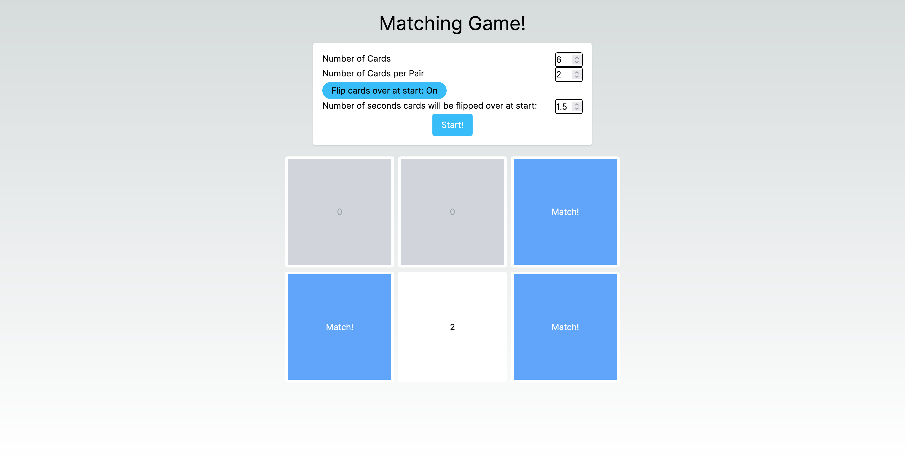
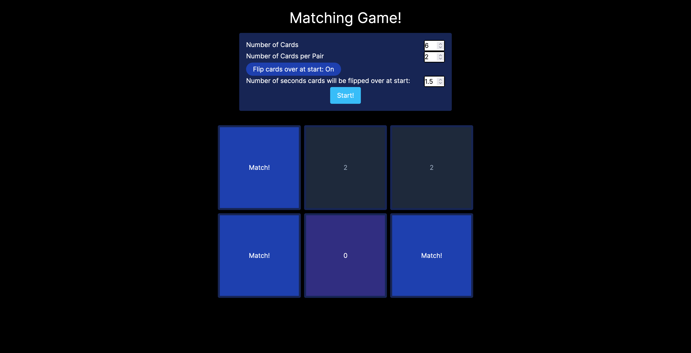

# Next-Powered Matching Game
A simple card matching game where you match numbers.

## Wanna Play?
You can play the game [here](https://uria-browser-matching-game.netlify.app/)!

Enter into the input prompts before starting. Feel free to tweak the settings to your liking!

To start, click the start button. The cards will appear below. You can restart at any time by clicking start again.

Click on the cards to flip them. They will reveal the other side. The cards will automatically flip back once you flip over the amount of cards set in the "matches" setting.

## Here's how the game looks:
### Light Mode

### Dark Mode

## Wanna see the original? 
You can find the repo of the original [here](https://github.com/uriapete/BrowserMatchingGame), and play the original [here](https://uriapete.github.io/BrowserMatchingGame/).
